# ClawSetup


**面向 macOS 的小白友好 OpenClaw Desktop Client。**  
通过简单的可视化界面完成 OpenClaw 的本地安装、配置与运行。

[English](./README.md)

> 一键安装，无需终端，专为新手设计。

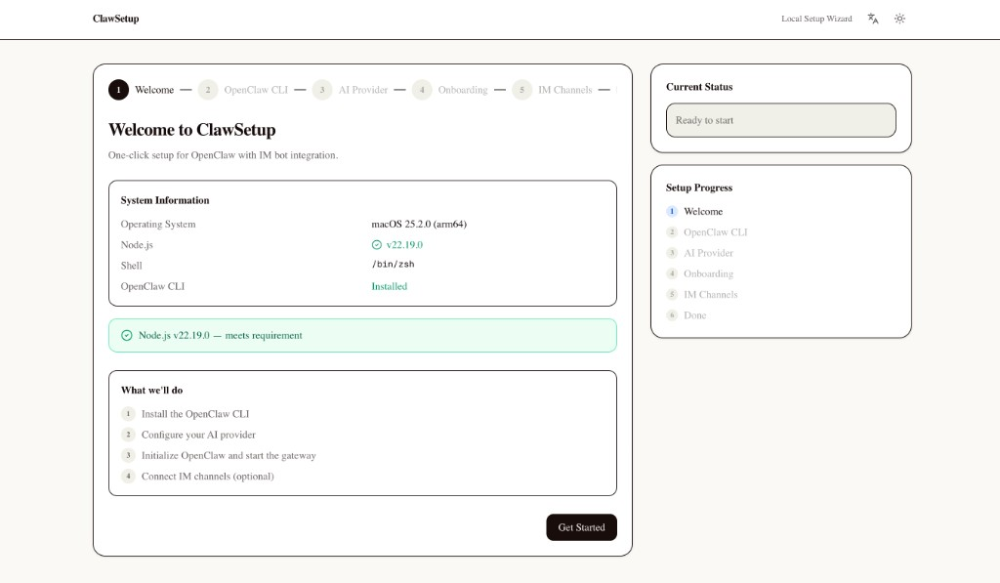

ClawSetup 帮助新手和非技术用户在 macOS 上更轻松地开始使用 OpenClaw，无需手动安装依赖、记忆命令行流程，也不用再猜测运行状态是否正常。

## 为什么需要 ClawSetup

OpenClaw 很强大，但它的本地部署流程对很多新用户来说仍然偏技术化。

对初次接触的用户来说，常见门槛包括：
- 需要手动安装依赖
- 需要执行不熟悉的终端命令
- 需要编辑配置文件
- 需要正确连接 provider
- 很难判断 OpenClaw 是否真的已经跑起来

这些摩擦会让很多用户在真正体验到 OpenClaw 价值之前就流失掉。

ClawSetup 就是为了解决这个问题而存在的。

## 你能获得什么

- 一键安装所需依赖
- 面向新手的可视化 setup 流程
- 飞书 provider 配置
- 本地运行启动与验证
- 安装状态与诊断信息
- 日志查看与配置编辑
- 安装完成后的轻量本地 dashboard

## 适合谁

- 第一次接触 OpenClaw 的新手用户
- 更偏好图形界面而不是终端的非技术用户
- 需要快速完成本地环境搭建的 workshop / hackathon 参与者
- 希望更轻松运行 OpenClaw 的用户

## 工作流程

ClawSetup 会通过一个简单的本地引导流程帮助用户完成 setup：

1. 检查本地环境
2. 安装所需依赖
3. 配置 OpenClaw 与 provider
4. 启动本地 OpenClaw
5. 验证运行状态
6. 从轻量 dashboard 继续使用

目标是让 OpenClaw 的本地上手过程更简单、更直观、更有信心感。

## 使用流程

### 1. 欢迎页与环境信息

ClawSetup 会先展示欢迎页、本机环境信息，以及整个 setup 流程的概览，让用户知道接下来会发生什么。


### 2. 检查 OpenClaw CLI

向导会先确认 OpenClaw CLI 是否已安装，并用清晰的结果状态引导用户进入下一步。

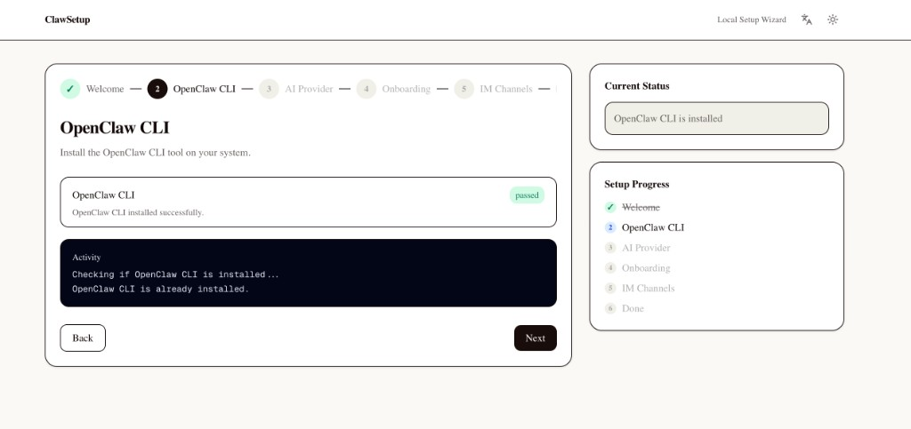

### 3. 配置 AI Provider

用户可以直接在界面里选择 provider、填写 API Key，并完成校验，而不需要手动修改本地配置文件。

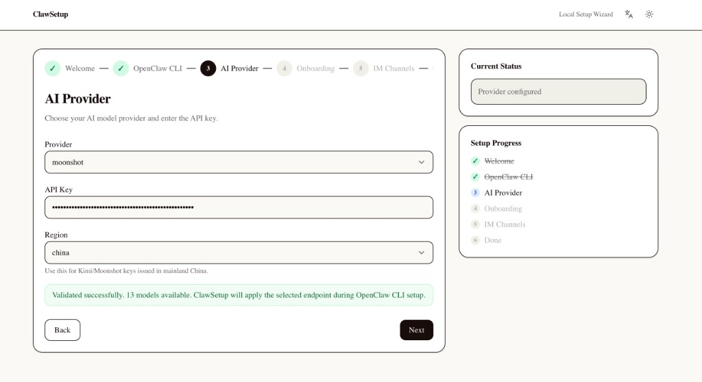

### 4. 执行 Onboarding

ClawSetup 会开始配置 OpenClaw，并实时展示当前进度，让新手也能理解系统正在做什么。

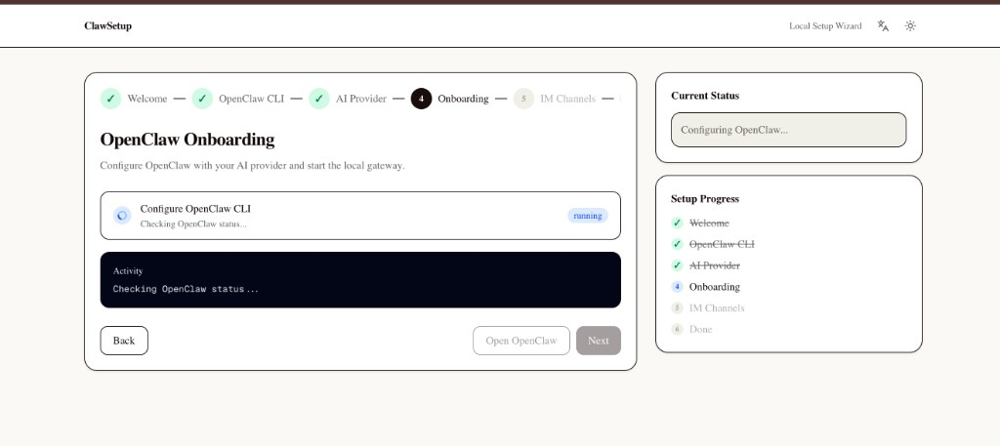

### 5. 确认 OpenClaw 已就绪

当初始化成功后，界面会明确告诉用户 OpenClaw 已在本地可用，并展示日志与后续入口。

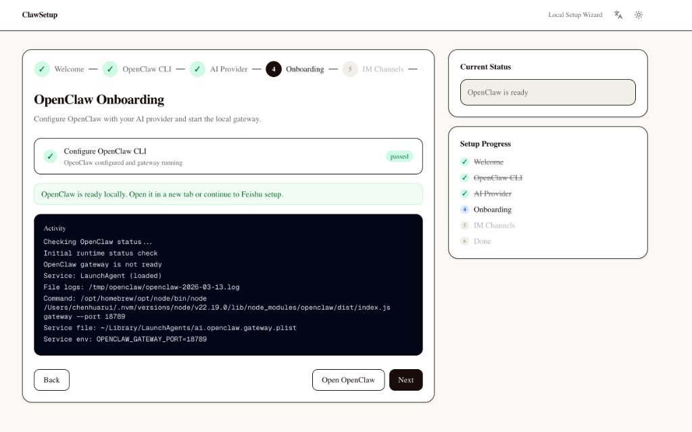

### 6. 开始飞书连接

如果需要接入飞书，向导会继续引导用户填写 App 信息。这个步骤是可选的，但流程依然保持可视化。

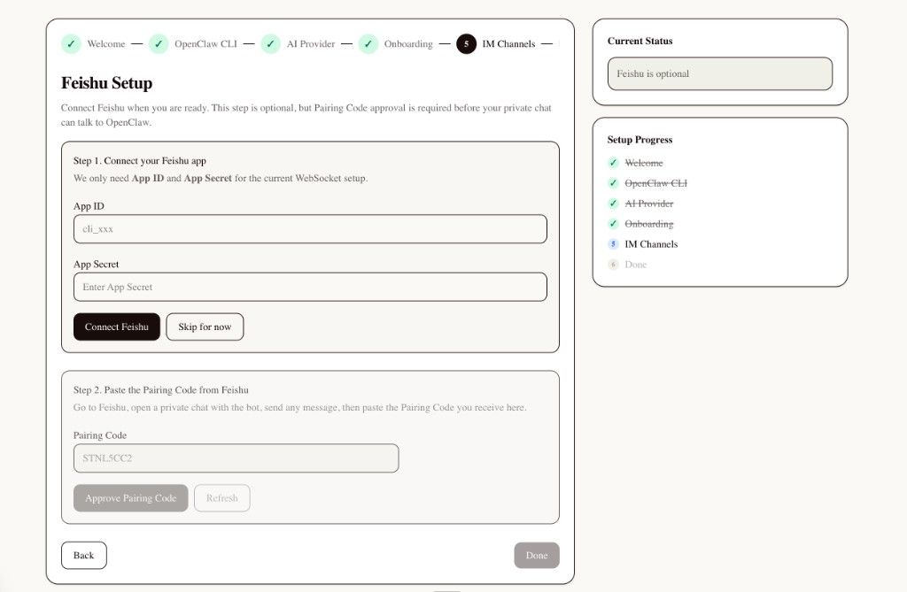

### 7. 确认飞书已连接

连接飞书应用后，界面会给出明确反馈，并提示用户继续完成后续配对流程。

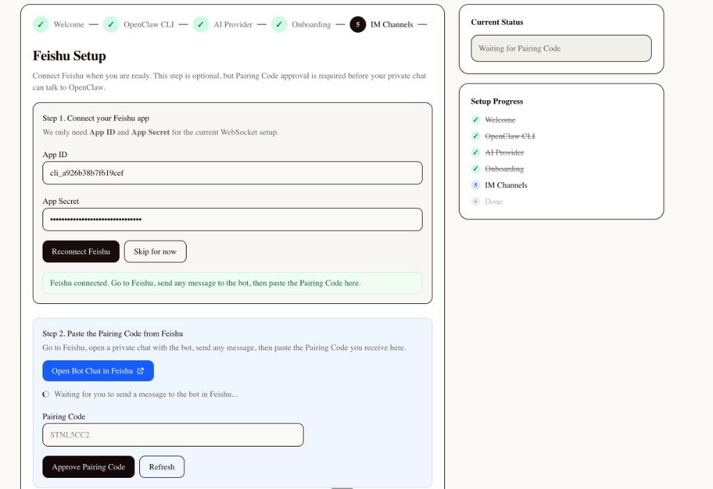

### 8. 查看配对审批状态

ClawSetup 会展示当前配对进度和审批状态，避免用户反复切换终端检查。

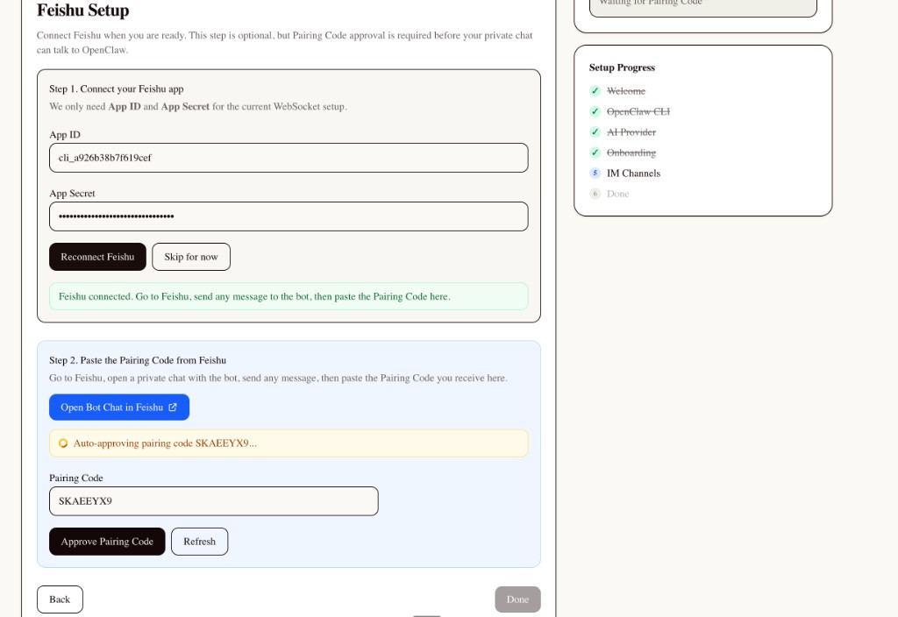

### 9. 完成飞书配对

当 Pairing Code 审批通过后，界面会明确告知 IM Channel 已经准备就绪。

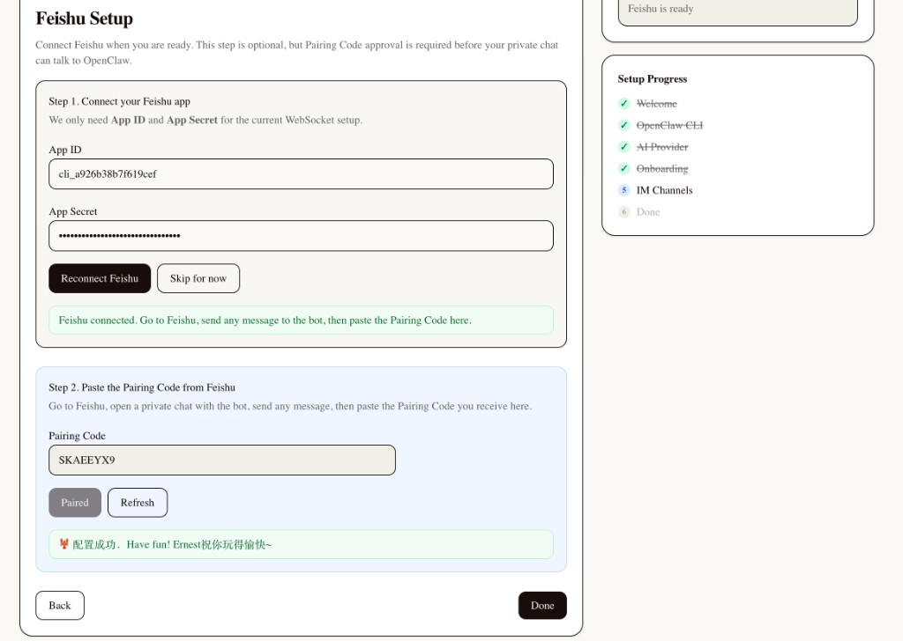

### 10. 完成整个 Setup

最后的完成页会总结当前状态，并提供进入 OpenClaw Dashboard 的直接入口。

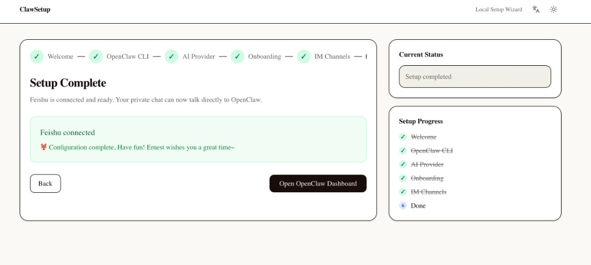

### 11. 在飞书中验证结果

配对完成后，用户还可以直接在飞书里看到成功消息，确认整个链路已经跑通。

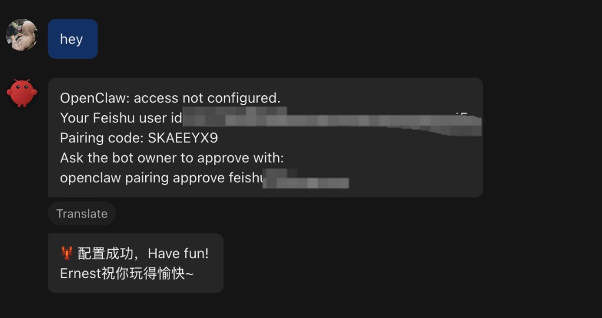

## 快速开始

```bash
git clone https://github.com/huaruic/clawsetup.git
cd clawsetup
npm install
npm run dev
```

然后打开：

```text
http://localhost:3000
```

## 当前范围

ClawSetup 当前重点聚焦于：
- 仅支持 macOS
- 本地可视化 setup
- 一键安装依赖
- 以飞书作为首个 provider 集成
- 本地 OpenClaw 运行启动
- 轻量 dashboard 能力

ClawSetup 当前是未来 OpenClaw Desktop Client 的安装与引导层。

## 当前支持的 Provider

当前支持：
- 飞书

计划支持：
- OpenAI
- Anthropic
- Gemini
- Moonshot

飞书只是当前用于打通完整本地 setup 链路的首个 provider，不是产品的长期边界。

## Local-First 设计

ClawSetup 以本地使用 OpenClaw 为核心设计方向。

这意味着：
- setup 体验不依赖云端服务
- 运行状态与配置由用户本地掌控
- 更符合隐私优先与本地优先的理念
- 更适合希望在自己设备上运行 AI 工具的用户

## 为什么它重要

ClawSetup 不只是一个 setup helper。

它是未来 OpenClaw Desktop Client 的早期形态：
- 比终端 setup 更容易理解
- 对新手更友好
- 更可视化，也更有确认感
- 更适合帮助 OpenClaw 触达更广泛用户

## 路线图

### 当前阶段

- macOS setup wizard
- 一键安装依赖
- 飞书 provider 配置
- 本地运行启动与验证

### 下一阶段

- 更完整的本地 dashboard
- 更好的日志可见性
- 更清晰的配置管理
- 更强的 onboarding 体验

### 后续阶段

- 更多 provider 支持
- 桌面应用封装
- 更深的 OpenClaw 本地管理能力
- 跨平台探索

## Demo

上面的截图已经覆盖了当前 setup 流程的主要阶段：欢迎页、CLI 检查、provider 配置、onboarding、飞书配对和完成态。

后续可以再补充一段简短的 GIF 或视频，把同样的流程动态展示出来。

## 为什么做这个项目

ClawSetup 的起点其实很简单：

很多人对 OpenClaw 感兴趣，但本地 setup 依然对新手不够友好。

这个项目希望通过可视化、引导式、local-first 的体验，让更多人真正开始使用 OpenClaw。

## 技术栈

- [Next.js 16](https://nextjs.org) with App Router
- React 19
- [shadcn/ui](https://ui.shadcn.com)
- Tailwind CSS v4
- TypeScript
- [Zod](https://zod.dev)
- [execa](https://github.com/sindresorhus/execa)

## 本地开发

```bash
npm install
npm run dev
npm run lint
npm run build
```

## 参与贡献

欢迎贡献。

如果你想改进 onboarding 流程、provider 支持、本地运行体验或者产品打磨，欢迎提交 issue 或 pull request。

## 许可证

[MIT](./LICENSE)
